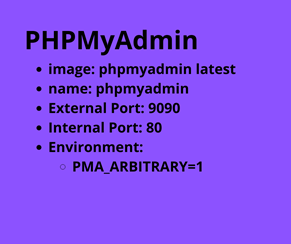
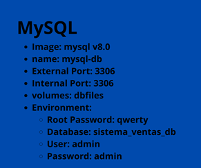
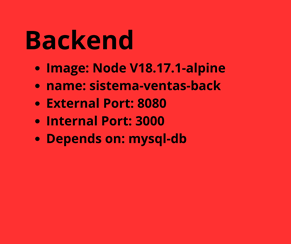
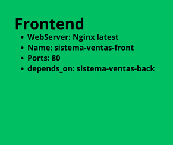
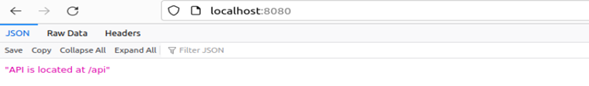
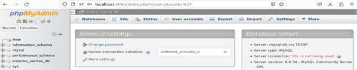

## Instrucciones:

#### A partir de los siguientes recursos (https://github.com/edomenzain/automatizacion-redes) realizar lo siguiente:

- Crear un archivo YML con el siguiente nombre: stack-iniciales-alumno.yml
- Agregar y mostrar el proceso de la creación del servicio de PhpMyAdmin utilizando la imagen oficial de Docker Hub (https://hub.docker.com/) de acuerdo a la siguiente configuración:

    

- Agregar y mostrar el proceso de la creación del servicio de MySql Server utilizando la imagen oficial de Docker Hub (https://hub.docker.com/) de acuerdo a la siguiente configuración:

    

- Crear el archivo Dockerfile para configurar el servicio backend
  - Usar la versión de node 18.17.1-alpine
  - Crear un directorio en /usr/src/app
  - Copiar los archivos package.json y package-lock.json al directorio raíz ./
  - Instalar las dependencias: Ejecutar el comando npm install
  - Copiar todo el directorio del proyecto al contenedor.
  - Exponer el puerto 3000
  - Agregar el comando CMD [“node”, “index.js”]
  - A partir del archivo Dockerfile creado para el backend se debe construir el contenedor de acuerdo a la siguiente configuración:

    

- Crear el archivo Dockerfile para configurar el servicio frontend
  - Usar la versión de nginx:stable-alpine.
  - Crear un volumen con el nombre /temp
  - Eliminar de la imagen el contenido de la carpeta /usr/share/nginx/html/*
  - Copiar el contenido de la configuración de nginx.conf, mime.types y el directorio sistema-ventas-front a sus respectivas carpetas.
  - Exponer el puerto 80.
  - Ejecutar el comando: CMD[“nginx”, “-g”, “daemon off;”]
- A partir del archivo Dockerfile creado para el frontend se debe construir el contenedor de acuerdo a la siguiente configuración:

    

**El resultado final debe ser el siguiente:**
- Frontend:
  - usuario: **admin**
  - Contraseña: **12345678**

    

- Backend:

    

- PhpMyAdmin:

    

